# 风控建模实战

关于风控建模实战的书籍。

# 仓库结构

仓库主体结构如下所示：

~~~text
credit-risk-modeling/
│
├── data/ # 示例数据（合成/公开小样本）
│ ├── sample/ # 书中示例用的小型数据集
│ └── README.md # 说明数据来源与生成方式
│
├── notebooks/ # 按章节组织的分析笔记本
│
├── src/ # 可复用的建模函数与工具
│
└── reports/ # 图表与结果输出
~~~

# 书籍大纲

书籍大纲暂时参考下图：

**第一章　Python 基础入门**

**1.1 环境搭建**

- Anaconda 安装与 Jupyter Notebook 使用
- 虚拟环境管理（conda env）
- 常用快捷键与调试技巧

**1.2 基础语法**

- 变量类型：int、float、str、bool
- 字符串操作：切片、格式化、正则表达式基础
- 运算符与表达式

**1.3 流程控制**

- if / elif / else 条件判断
- for / while 循环
- break、continue、pass

**1.4 函数与模块**

- 函数定义、参数、返回值
- lambda 匿名函数
- 模块导入（import / from）
- 常用内置函数（map、filter、zip）

**1.5 数据结构**

- 列表（list）：增删改查、列表推导式
- 字典（dict）：键值对操作、嵌套字典
- 元组（tuple）与集合（set）
- 数据结构的选择原则

**1.6 文件读写**

- 读写 txt / CSV 文件
- 异常处理（try / except）
- 路径管理（os、pathlib）

------

**第二章　数据处理与分析**

**2.1 NumPy 核心**

- 数组创建与基本属性（shape、dtype）
- 索引与切片
- 向量化运算（避免 for 循环）
- 常用函数：mean、std、percentile、where
- 矩阵运算与线性代数基础

**2.2 Pandas 数据处理**

- Series 与 DataFrame 创建
- 数据读取：read_csv、read_excel、read_sql
- 数据探索：info、describe、value_counts
- 缺失值处理：检测、填充、删除策略
- 数据筛选：loc、iloc、条件过滤
- 数据变换：apply、map、replace
- 分组聚合：groupby、pivot_table
- 时间序列：账龄计算、日期格式转换
- 数据合并：merge、concat、join

**2.3 数据可视化**

- Matplotlib 基础：折线图、柱状图、散点图
- Seaborn 统计图：分布图、热力图、箱线图
- 风控常用图表：坏账率分布、逾期趋势、特征相关性热力图

------

**第三章　风控业务基础**

**3.1 信贷风控业务流程**

- 贷前-贷中-贷后完整链路
- 申请、授信、放款、还款、逾期、催收各环节
- 核心风控指标：通过率、坏账率、逾期率、损失率（LGD）

**3.2 评分卡体系**

- A卡（申请评分卡）：准入决策
- B卡（行为评分卡）：额度管理
- C卡（催收评分卡）：催收优先级
- 三卡的区别与联系

**3.3 传统评分卡建模**

- WOE（证据权重）原理与计算
- IV（信息价值）与特征筛选标准
- 分箱方法：等频、等距、最优分箱（ChiMerge）
- 逻辑回归评分卡转化：PDO 与基准分

**3.4 样本与标签设计**

- 观察窗口与表现窗口的定义
- 好坏样本定义（逾期天数阈值：M1/M2/M3）
- 样本不平衡问题概述
- 跨期样本与时间穿越风险

**3.5 监管合规基础**

- 巴塞尔协议（Basel II/III）对模型的要求
- PD / LGD / EAD 概念
- 模型文档与验证要求（MRM 框架）
- 数据隐私合规（GDPR、个人信息保护法）

------

**第四章　逻辑回归与树模型**

**4.1 逻辑回归**

- 原理：sigmoid 函数与对数几率
- 系数解释与业务含义
- 正则化：L1（Lasso）、L2（Ridge）
- 多重共线性检测（VIF）

**4.2 决策树**

- 基尼系数与信息增益
- 树的生长与剪枝
- 过拟合与欠拟合的识别

**4.3 集成树模型**

- 随机森林：Bagging 思想
- XGBoost：Boosting + 二阶导数优化
- LightGBM：直方图算法与叶子分裂策略
- 三者的适用场景对比

**4.4 模型可解释性**

- 逻辑回归的天然可解释性
- SHAP 值原理与可视化
- LIME 局部解释
- 监管要求下的可解释性取舍

------

**第五章　特征工程与筛选**

**5.1 特征类型与处理**

- 数值特征：标准化、归一化、对数变换
- 类别特征：Label Encoding、One-Hot、Target Encoding
- 时序特征：滚动统计、账龄、行为序列

**5.2 风控专属特征**

- 申请信息特征（年龄、收入、负债比）
- 行为特征（历史还款、查询次数、消费频率）
- 外部数据特征（征信、运营商、电商数据）
- 特征衍生：比率类、差值类、趋势类

**5.3 特征筛选方法**

- 过滤法：IV 值、相关系数、方差过滤
- 包裹法：递归特征消除（RFE）
- 嵌入法：树模型特征重要性、L1 正则化
- PSI 稳定性筛选（剔除分布漂移特征）

**5.4 处理样本不平衡**

- 过采样：SMOTE 及其变种
- 欠采样：随机欠采样、Tomek Links
- 类别权重调整（class_weight）
- 阈值调整策略

------

**第六章　超参数调优**

**6.1 调优基础**

- 偏差-方差权衡（Bias-Variance Tradeoff）
- 训练集 / 验证集 / 测试集划分
- 时间序列数据的正确切分方式（避免未来数据泄露）

**6.2 交叉验证**

- K-Fold 交叉验证
- StratifiedKFold（处理类别不平衡）
- TimeSeriesSplit（风控时序场景）

**6.3 调优方法**

- 网格搜索（GridSearchCV）
- 随机搜索（RandomizedSearchCV）
- 贝叶斯优化（Optuna / Hyperopt）
- 早停机制（Early Stopping）

**6.4 XGBoost / LightGBM 关键参数**

- 树深度、学习率、子采样率
- 正则化参数 lambda / alpha
- 调参顺序与经验准则

------

**第七章　模型评估**

**7.1 分类评估基础**

- 混淆矩阵：TP / TN / FP / FN
- 精确率、召回率、F1-Score
- 阈值选择与业务目标的对应关系

**7.2 风控专属评估指标**

- KS（Kolmogorov-Smirnov）：区分度衡量
- AUC-ROC：整体排序能力
- Gini 系数与 AUC 的换算关系
- PR 曲线（类别不平衡时更合适）

**7.3 稳定性评估**

- PSI（Population Stability Index）：群体稳定性
- CSI（Characteristic Stability Index）：特征稳定性
- PSI 阈值解读（<0.1 稳定 / 0.1–0.25 关注 / >0.25 重建）

**7.4 跨时间验证**

- 跨期验证（OOT，Out-of-Time）
- Vintage 分析：不同放款批次的坏账表现
- 模型衰退识别与预警

------

**第八章　模型上线与部署**

**8.1 模型保存与加载**

- pickle / joblib 序列化
- PMML 格式（适合跨语言部署）
- ONNX 格式

**8.2 评分卡标准格式输出**

- 评分卡 Excel 报告生成
- 分数段分布与拒绝率曲线
- 与系统对接的接口规范

**8.3 API 服务化**

- Flask / FastAPI 封装模型接口
- 请求参数校验与异常处理
- Docker 容器化部署基础

**8.4 A/B 测试**

- 上线前的冠军-挑战者（Champion-Challenger）策略
- 流量分配与统计显著性
- 灰度发布与回滚机制

------

**第九章　模型监控与迭代**

**9.1 监控体系设计**

- 数据层监控：特征缺失率、分布漂移（PSI）
- 模型层监控：KS / AUC 定期回测
- 业务层监控：通过率、坏账率趋势

**9.2 模型衰退处理**

- 衰退原因分析：样本漂移 vs 关系变化
- 重训练触发条件与频率
- 模型版本管理

**9.3 特征监控**

- 关键特征 CSI 监控
- 外部数据源质量监控（接口异常、缺数）
- 自动化监控报告生成

**9.4 模型迭代流程**

- 数据更新 → 重新分箱 → 重训练 → 评估 → 上线的完整闭环
- 模型文档更新规范
- 与业务团队的沟通节奏

------

**第十章　反欺诈建模实战**

**10.1 反欺诈业务背景**

- 欺诈类型：身份欺诈、团伙欺诈、羊毛党、合规欺诈
- 与信用风险的区别（欺诈是主观的）
- 欺诈样本的稀缺性挑战

**10.2 规则引擎**

- 黑名单 / 白名单机制
- 设备指纹与 IP 风险
- 规则组合与评分叠加

**10.3 无监督检测方法**

- 异常检测：Isolation Forest、Local Outlier Factor
- 聚类分析：K-Means 发现异常群体
- 关联规则挖掘

**10.4 图网络风控**

- 团伙欺诈的关系网络建模思路
- 共享设备 / 手机 / 地址的关联图谱
- 图算法简介（PageRank、社区发现）

**10.5 有监督欺诈模型**

- 标签定义与样本构建
- 类别极度不平衡的处理
- 实时评分 vs 批量评分的架构差异

------

**第十一章　端到端项目实战**

**11.1 项目背景与数据说明**

- 使用公开数据集（如 LendingClub、Give Me Some Credit）
- 数据字段解读与业务背景

**11.2 数据预处理**

- 原始数据清洗全流程
- 样本筛选与标签定义
- 特征探索性分析（EDA）

**11.3 建模流程**

- 特征工程（WOE 分箱 + 机器学习特征并行）
- 模型训练与调优
- 模型评估报告生成

**11.4 模型输出与交付**

- 评分卡格式输出
- 业务报告撰写要点
- 模型文档（Model Card）编写模板

**11.5 项目总结与复盘**

- 常见踩坑汇总
- 建模质量自查清单
- 延伸方向：联邦学习、实时风控、大模型在风控中的应用

------

**附录**

- **附录A**：常用 Python 函数速查表
- **附录B**：风控术语中英对照表
- **附录C**：公开数据集资源列表
- **附录D**：推荐书单与延伸阅读
- **附录E**：配套代码 GitHub 仓库说明
